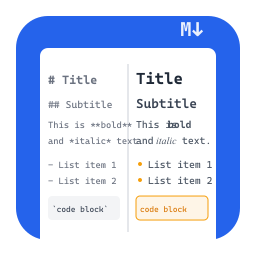
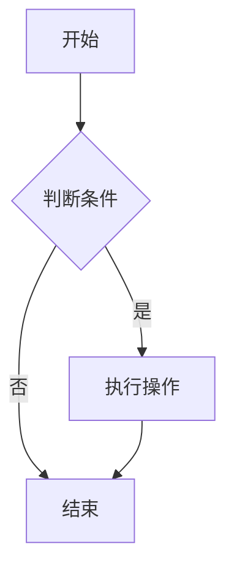

# MKReader

<div align="center">



**一个功能强大、现代化的 Markdown 文件阅读器**

[](package.json)
[](LICENSE)
[](https://electronjs.org/)

[功能特性](#-功能特性) • [快速开始](#-快速开始) • [使用说明](#-使用说明) • [开发指南](#-开发指南) • [贡献指南](#-贡献指南)

</div>

## 📖 项目简介

MKReader 是一个基于 Electron 开发的现代化 Markdown 文件阅读器，专为提供优雅的 Markdown 文档阅读体验而设计。它支持多标签页浏览、代码高亮、Mermaid 图表渲染、全屏阅读等丰富功能，是开发者和文档爱好者的理想选择。

## ✨ 功能特性

### 🎯 核心功能

- **📑 多标签页管理** - 同时打开多个 Markdown 文件，支持标签页切换和管理
- **🎨 实时渲染** - 基于 markdown-it 的高质量 Markdown 渲染
- **🔍 文档大纲** - 自动生成文档结构导航，快速跳转到任意章节
- **📁 文件关联** - 自动关联 .md 文件，双击即可打开

### 🎨 视觉体验

- **🌙 主题支持** - 支持明暗主题切换，护眼阅读
- **📏 响应式设计** - 自适应不同屏幕尺寸，提供最佳阅读体验
- **🎪 全屏模式** - 沉浸式阅读体验，专注内容
- **🎯 代码高亮** - 基于 Prism.js 的多语言语法高亮

### 📊 Mermaid 图表

- **🔄 实时渲染** - 支持 19+ 种 Mermaid 图表类型

  - 流程图 (Flowchart)
  - 序列图 (Sequence Diagram)
  - 类图 (Class Diagram)
  - 状态图 (State Diagram)
  - 甘特图 (Gantt Chart)
  - 饼图 (Pie Chart)
  - Git 图 (Git Graph)
  - 思维导图 (Mind Map)
  - 时间轴 (Timeline)
  - 等等...

- **🎛️ 交互控制**

  - 缩放控制 (放大/缩小/适应屏幕)
  - 图表导出 (PNG/SVG 格式)
  - 代码复制和刷新
  - 响应式适配

- **⚙️ 丰富设置**
  - 5 种内置主题 (default/neutral/dark/forest/base)
  - 显示选项自定义
  - 8 种常用模板示例
  - 设置自动保存

### 💾 导出功能

- **📤 多格式导出** - 支持 HTML、PDF 格式导出
- **🎨 样式保持** - 导出时保持原有样式和格式
- **🖼️ 图片处理** - 自动处理文档中的图片和图表

### 🔧 开发者友好

- **⚡ 快捷键支持** - 丰富的键盘快捷键
- **🔄 热重载** - 文件变化自动刷新
- **🐛 调试模式** - 内置开发者工具支持

## 🚀 快速开始

### 系统要求

- **操作系统**: Windows 10/11, macOS 10.14+, Linux (Ubuntu 18.04+)
- **内存**: 512MB 可用内存
- **磁盘空间**: 200MB 可用空间

### 安装方式

#### 方式一：下载预构建版本

1. 前往 [Releases](https://github.com/your-repo/mkreader/releases) 页面
2. 下载适合您操作系统的安装包
3. 运行安装程序并按提示完成安装

#### 方式二：从源码构建

```bash
# 1. 克隆项目
git clone https://github.com/your-repo/mkreader.git
cd mkreader

# 2. 安装依赖
npm install

# 3. 启动开发模式
npm start

# 4. 构建应用 (可选)
npm run build
```

### 首次使用

1. 启动 MKReader
2. 点击 "File" → "Open File" 或使用快捷键 `Ctrl+O` 打开 Markdown 文件
3. 也可以直接双击 .md 文件（如已关联文件类型）

## 📚 使用说明

### 基本操作

| 功能         | 操作方式                   | 快捷键         |
| ------------ | -------------------------- | -------------- |
| 打开文件     | File → Open File           | `Ctrl+O`       |
| 打开多个文件 | File → Open Multiple Files | `Ctrl+Shift+O` |
| 新建标签     | 点击 + 按钮                | `Ctrl+T`       |
| 关闭标签     | 点击标签 × 按钮            | `Ctrl+W`       |
| 切换标签     | 点击标签或滚轮             | `Ctrl+Tab`     |
| 全屏模式     | View → Toggle Fullscreen   | `F11`          |
| 导出文件     | File → Export              | `Ctrl+E`       |

### Mermaid 图表使用

在 Markdown 文档中使用以下语法创建图表：

````markdown

````

#### 访问 Mermaid 设置

- **菜单**: Tools → Mermaid Diagram Settings
- **图表工具栏**: 点击设置按钮

### 代码高亮

支持 190+ 种编程语言的语法高亮：

````markdown
```javascript
function hello() {
  console.log("Hello, MKReader!");
}
```

```python
def fibonacci(n):
    if n <= 1:
        return n
    return fibonacci(n-1) + fibonacci(n-2)
```
````

### 导出功能

1. 打开要导出的 Markdown 文件
2. 点击工具栏的导出按钮或使用 `Ctrl+E`
3. 选择导出格式 (HTML/PDF)
4. 选择保存位置

## 🛠️ 开发指南

### 项目结构

```
mkreader/
├── src/                          # 源代码目录
│   ├── main.js                   # Electron 主进程
│   ├── preload.js                # 预加载脚本
│   └── renderer/                 # 渲染进程
│       ├── index.html            # 主页面
│       ├── renderer.js           # 渲染进程主逻辑
│       ├── tab-manager.js        # 标签页管理
│       ├── outline.js            # 大纲导航
│       ├── code-highlighter.js   # 代码高亮
│       ├── mermaid-renderer.js   # Mermaid 渲染器
│       ├── export-manager.js     # 导出功能
│       └── *.css                 # 样式文件
├── assets/                       # 资源文件
│   ├── icon.png                  # 应用图标
│   └── icons/                    # 多尺寸图标
├── example/                      # 示例文件
├── docs/                         # 项目文档
└── package.json                  # 项目配置
```

### 核心依赖

| 依赖          | 版本     | 用途               |
| ------------- | -------- | ------------------ |
| `electron`    | ^37.2.6  | 跨平台桌面应用框架 |
| `markdown-it` | ^14.1.0  | Markdown 解析器    |
| `mermaid`     | ^11.10.1 | 图表渲染库         |
| `prismjs`     | ^1.30.0  | 代码语法高亮       |
| `html2canvas` | ^1.4.1   | HTML 转图片        |
| `jspdf`       | ^3.0.2   | PDF 生成           |
| `chokidar`    | ^4.0.3   | 文件监控           |

### 开发命令

```bash
# 安装依赖
npm install

# 启动开发模式
npm start

# 构建应用
npm run build

# 生成图标
npm run generate-icons
```

### 架构设计

MKReader 采用模块化架构设计：

```
Main Process (main.js)
    ↓ IPC Communication
Renderer Process (renderer.js)
    ├── TabManager (标签管理)
    ├── OutlineNavigator (大纲导航)
    ├── CodeHighlighter (代码高亮)
    ├── MermaidRenderer (图表渲染)
    └── ExportManager (导出功能)
```

## 🤝 贡献指南

我们欢迎所有形式的贡献！

### 如何贡献

1. **Fork** 本项目
2. **创建** 特性分支 (`git checkout -b feature/AmazingFeature`)
3. **提交** 更改 (`git commit -m 'Add some AmazingFeature'`)
4. **推送** 到分支 (`git push origin feature/AmazingFeature`)
5. **创建** Pull Request

### 开发规范

- 遵循 JavaScript Standard Style
- 提交信息使用英文，格式: `type(scope): description`
- 新功能需要添加对应的文档
- 重要更改需要更新 CHANGELOG

### Bug 报告

使用 [Issues](https://github.com/your-repo/mkreader/issues) 报告 Bug，请包含：

- 操作系统和版本
- MKReader 版本
- 复现步骤
- 期望行为
- 实际行为
- 截图（如适用）

## 📄 许可证

本项目基于 [MIT 许可证](LICENSE) 开源。

## 🙏 致谢

感谢以下开源项目：

- [Electron](https://electronjs.org/) - 跨平台桌面应用框架
- [markdown-it](https://github.com/markdown-it/markdown-it) - Markdown 解析器
- [Mermaid](https://mermaid.js.org/) - 图表和图形生成库
- [Prism](https://prismjs.com/) - 代码语法高亮库
- [GitHub Markdown CSS](https://github.com/sindresorhus/github-markdown-css) - GitHub 风格样式

## 📞 联系我们

- **项目主页**: [https://github.com/your-repo/mkreader](https://github.com/your-repo/mkreader)
- **问题反馈**: [Issues](https://github.com/your-repo/mkreader/issues)
- **开发团队**: MKReader Team

---

<div align="center">

**⭐ 如果这个项目对您有帮助，请给它一个 Star ⭐**

Made with ❤️ by MKReader Team

</div>
