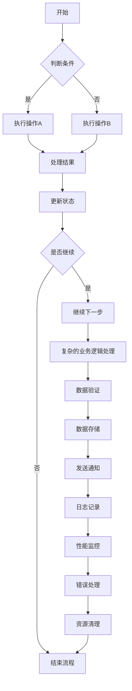
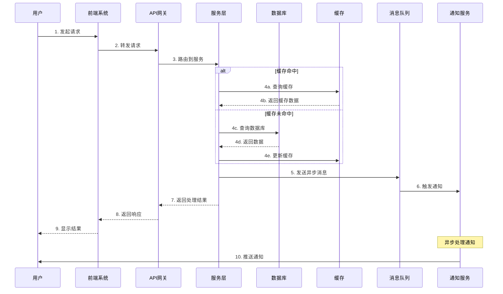
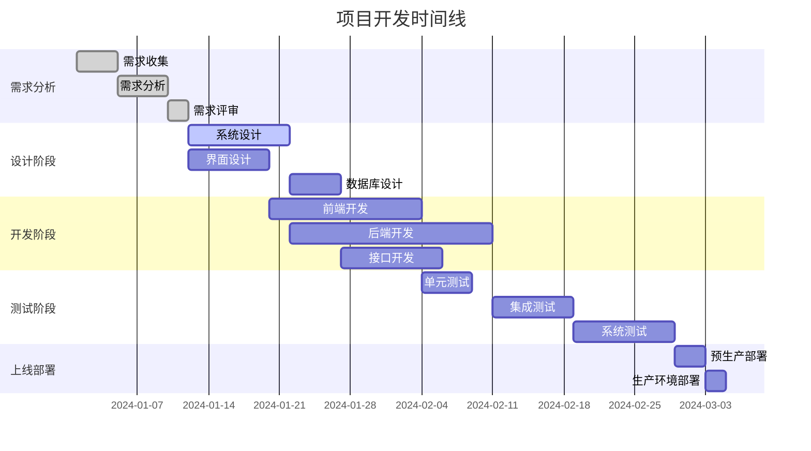
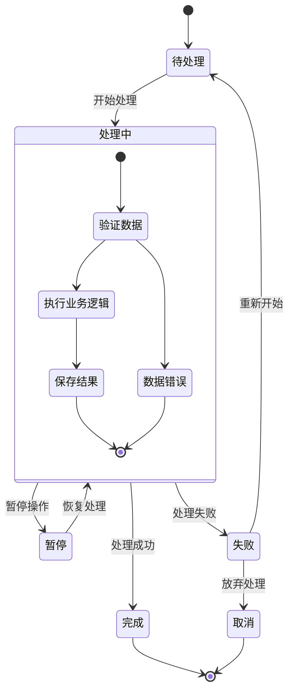
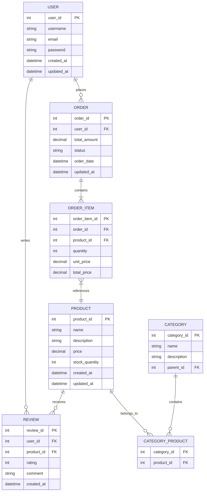

# 全屏模式测试文档

## 流程图测试

## 序列图（泳道图）测试

## 甘特图测试

## 状态图测试

## 实体关系图测试

通过这个测试文档，你可以：

1. **测试全屏功能**：点击任一图表右上角的 ⛶ 按钮进入全屏模式
2. **测试缩放功能**：使用工具栏上的缩放按钮或鼠标滚轮
3. **测试拖拽功能**：在全屏模式下拖拽图表查看不同区域
4. **测试适应功能**：点击 📐 按钮自动适应屏幕尺寸
5. **测试导出功能**：在全屏模式下导出高清图片
6. **测试关闭功能**：点击 ✕ 按钮或按 ESC 键关闭全屏模式
