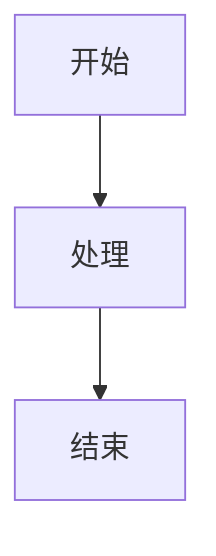

# Mermaid 错误测试

这个文件用于测试 Mermaid 错误处理机制。

## 1. 正常的 Mermaid 图表



## 2. 语法错误的 Mermaid 图表

这个图表包含语法错误，应该显示友好的错误信息而不是弹窗：

```mermaid
graph TD
    A[开始] --> B[处理
    B --> C[结束]
    错误的语法在这里
```

## 3. 另一个语法错误

```mermaid
sequenceDiagram
    participant A
    participant B
    A->>B: 消息
    B->>A: 回复
    这行有语法错误
```

## 4. 完全无效的内容

```mermaid
这完全不是 mermaid 语法
随便写的内容
```

测试完成。
