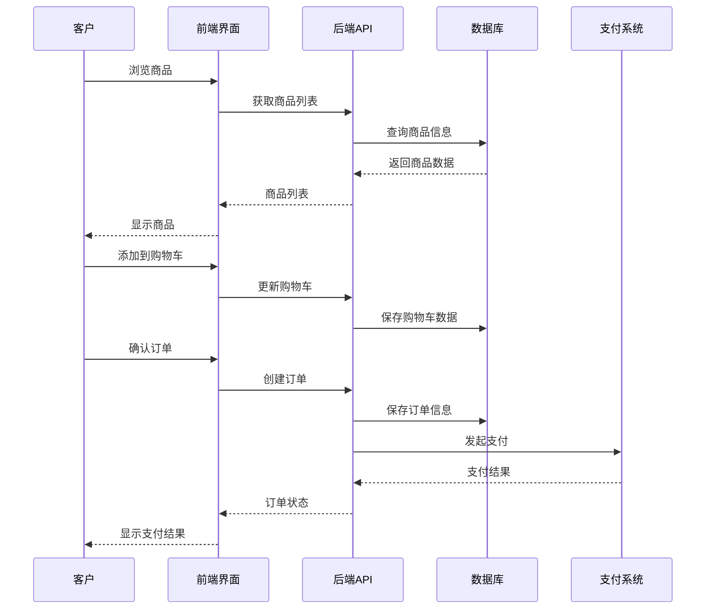
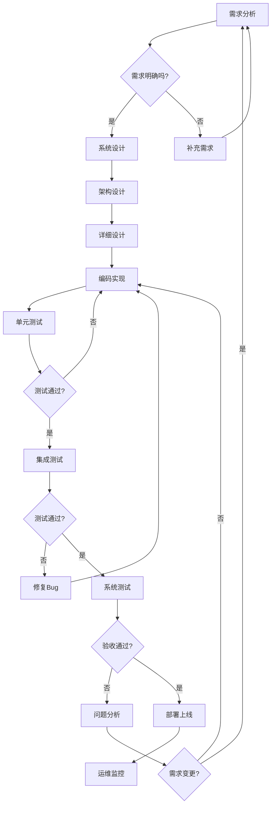
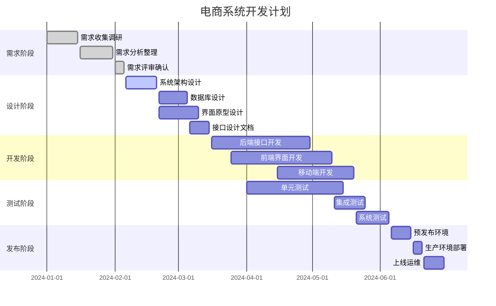
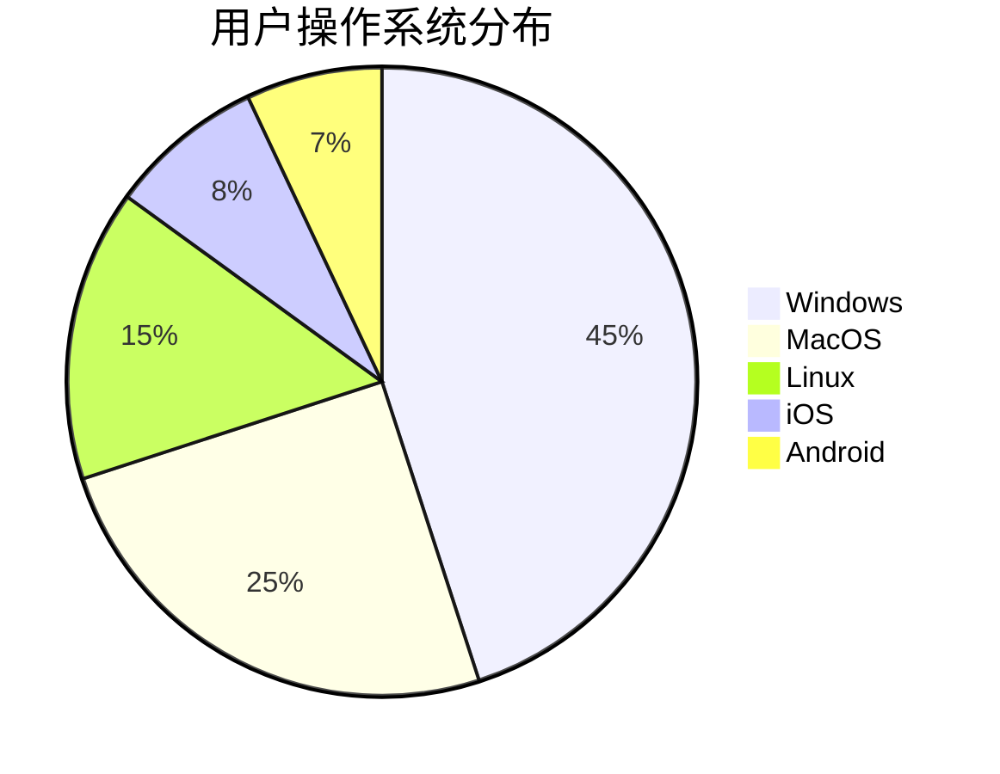
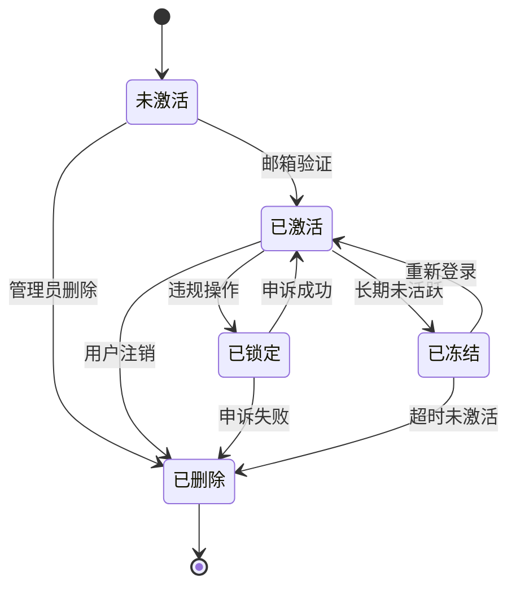
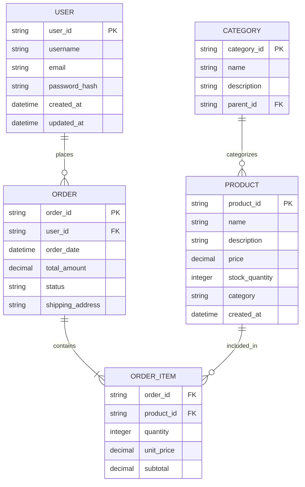
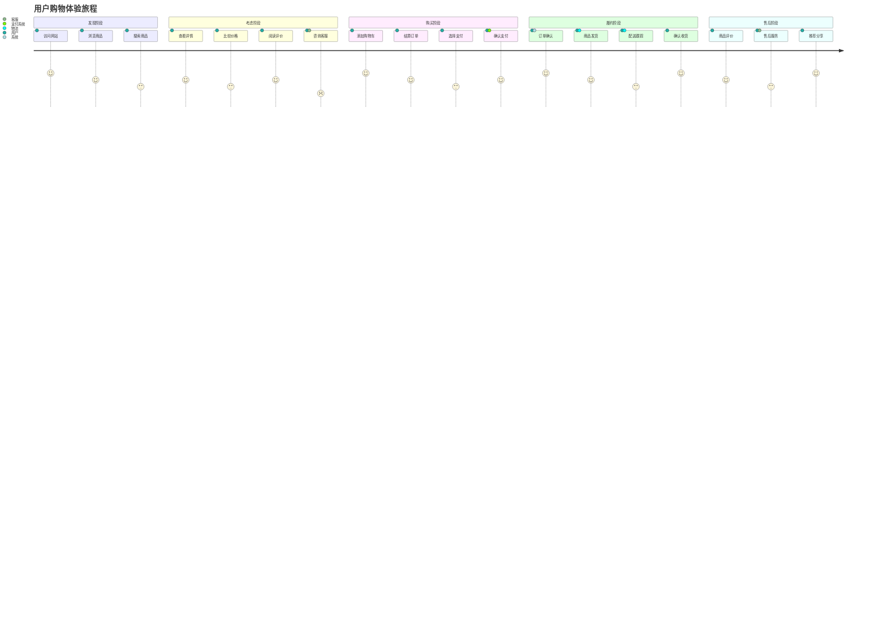

# Mermaid 图表测试

本文档用于测试 MKReader 中的 Mermaid 图表渲染功能。

## 1. 序列图/泳道图

以下是一个客户购买流程的序列图：



## 2. 流程图

下面是一个软件开发流程图：



## 3. 类图

这是一个简单的电商系统类图：

```mermaid
classDiagram
    class User {
        +String username
        +String email
        +String password
        +Date createTime
        +login()
        +logout()
        +updateProfile()
    }

    class Product {
        +String id
        +String name
        +String description
        +Double price
        +Integer stock
        +String category
        +updateStock()
        +updatePrice()
    }

    class Order {
        +String id
        +String userId
        +Date orderTime
        +Double totalAmount
        +String status
        +addProduct()
        +calculateTotal()
        +updateStatus()
    }

    class OrderItem {
        +String orderId
        +String productId
        +Integer quantity
        +Double unitPrice
        +Double subtotal
        +calculateSubtotal()
    }

    User ||--o{ Order
    Order ||--o{ OrderItem
    Product ||--o{ OrderItem
```

## 4. 甘特图

项目开发时间计划：



## 5. 饼图

用户操作系统分布：



## 6. 状态图

用户账户状态流转：



## 7. ER 图

数据库实体关系图：



## 8. 旅程图

用户购物体验旅程：



---

## 测试说明

以上图表覆盖了 Mermaid 支持的主要图表类型：

1. **序列图** - 展示系统交互流程
2. **流程图** - 描述业务或技术流程
3. **类图** - 显示系统类结构关系
4. **甘特图** - 项目时间进度规划
5. **饼图** - 数据比例分布
6. **状态图** - 状态流转过程
7. **ER 图** - 数据库实体关系
8. **旅程图** - 用户体验流程

每个图表都应该能够：

- ✅ 正确渲染显示
- ✅ 支持缩放控制
- ✅ 提供导出功能
- ✅ 复制源代码
- ✅ 响应式适配

如果图表无法正常显示，请检查：

1. Mermaid 库是否正确加载
2. 图表语法是否正确
3. 浏览器控制台是否有错误信息
4. 网络连接是否正常
