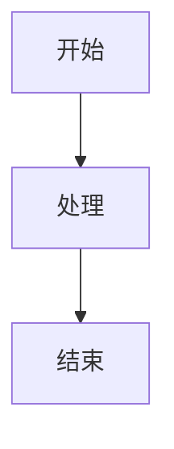

# 简单测试

这是一个简单的测试文件，用于验证基本功能。

## 代码示例

```javascript
function hello() {
  console.log("Hello, World!");
}
```

```html
<!DOCTYPE html>
<html>
  <head>
    <title>Test</title>
  </head>
  <body>
    <h1>Hello</h1>
  </body>
</html>
```

## Mermaid 简单测试



完成。
